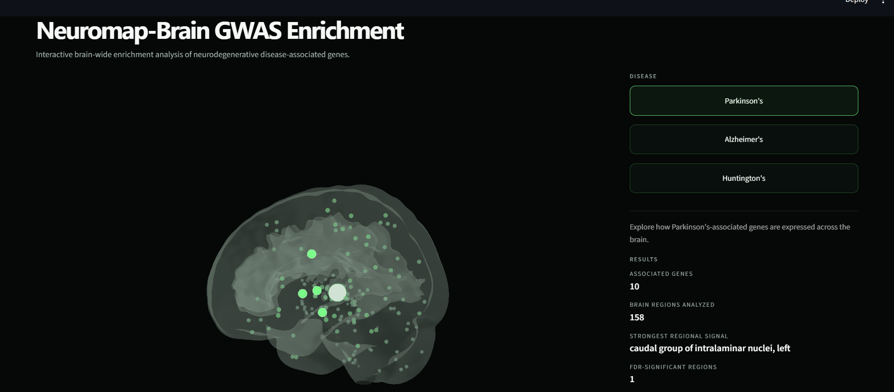

# NeuroAtlas — Brain-Wide Disease Enrichment

Interactive brain-wide analysis and visualization of neurodegenerative disease-associated genes across the human brain.

NeuroAtlas combines human brain gene-expression data, disease-associated gene sets, statistical enrichment analysis, and an interactive 3D brain visualization to explore where disease-associated molecular signals are distributed across brain regions.

## 🌐 Live Demo

**[Open NeuroAtlas →]https://neuroatlas.streamlit.app/**



---

## Overview

NeuroAtlas is an interactive scientific visualization tool for exploring regional patterns of gene-expression enrichment associated with neurodegenerative diseases.

The application maps disease-associated genes onto a standardized human brain atlas and allows users to interactively examine regional enrichment across **158 brain regions**.

The current implementation includes:

- Parkinson's disease
- Alzheimer's disease
- Huntington's disease

Rather than presenting the analysis as a diagnostic or clinical prediction system, NeuroAtlas is designed as an exploratory research and educational tool for understanding how disease-associated molecular signals vary across the brain.

---

## 🧠 What NeuroAtlas Does

NeuroAtlas follows a simple analysis pipeline:

**Disease-associated genes → Brain gene expression → Regional aggregation → Statistical enrichment → Multiple-testing correction → 3D brain visualization**

For each disease, the application:

1. Defines a disease-associated gene set.
2. Matches these genes against human brain expression data.
3. Aggregates gene expression across brain regions.
4. Normalizes gene-level expression across the brain.
5. Computes regional enrichment scores.
6. Evaluates enrichment using an expression-matched permutation procedure.
7. Applies False Discovery Rate (FDR) correction.
8. Visualizes the resulting regional signals on a 3D brain surface.

---

## 🔬 Data & Methodology

### Human Brain Expression

The analysis uses data from the **Allen Human Brain Atlas (AHBA)** to characterize gene expression across the human brain.

The processed dataset contains:

- **58,691 expression probes**
- **29,131 genes** after probe-to-gene aggregation
- **158 brain regions**
- MNI-space regional coordinates

Multiple probes mapping to the same gene are aggregated using the median expression value before regional analysis.

### Disease-Associated Gene Sets

The current analysis uses curated disease-associated gene sets.

| Disease | Genes |
|---|---:|
| Parkinson's disease | 10 |
| Alzheimer's disease | 10 |
| Huntington's disease | 1 |

The current gene sets include:

**Parkinson's disease**

`SNCA, LRRK2, GBA, PARK7, PINK1, PARK2, MAPT, APOE, BST1, GAK`

**Alzheimer's disease**

`APOE, PICALM, CLU, CR1, ABCA7, MS4A6A, CD33, EPHA1, BIN1, INPP5D`

**Huntington's disease**

`HTT`

---

## 📊 Statistical Analysis

For each disease, gene expression is standardized across the 158 brain regions using gene-wise z-normalization.

Regional enrichment is then evaluated using an expression-matched permutation framework.

The analysis uses:

- **5,000 permutations**
- Gene-wise normalization
- Expression-matched null distributions
- Regional enrichment statistics
- Multiple-testing correction using the **Benjamini–Hochberg False Discovery Rate (FDR)** procedure

This helps distinguish regional enrichment from patterns that could arise simply because some genes are generally more highly expressed than others.

---

## 🧪 Current Results

The current validated analysis produces the following results:

| Disease | Disease-associated genes | FDR-significant regions |
|---|---:|---:|
| Parkinson's disease | 10 | 1 |
| Alzheimer's disease | 10 | 0 |
| Huntington's disease | 1 | 0 |

For Parkinson's disease, one region passes the current FDR threshold:

**Long insular gyri, left**

- FDR ≈ **0.0316**
- Effect size ≈ **3.61**
- Normalized enrichment score ≈ **0.659**

For Alzheimer's disease and Huntington's disease, no regions pass the current FDR threshold under the implemented analysis.

These results describe the output of the current gene sets, brain-expression dataset, and statistical procedure. They should not be interpreted as evidence of clinical vulnerability, disease diagnosis, or causal involvement.

---

## 🧭 Interactive Visualization

The brain visualization is the primary interface of NeuroAtlas.

Users can:

- Rotate the 3D brain.
- Zoom and inspect different anatomical regions.
- Select a disease.
- View regional enrichment patterns.
- Distinguish stronger regional signals from FDR-significant regions.
- Explore all 158 brain regions, including regions without statistically significant enrichment.

The visualization uses a standardized MNI-space brain geometry with regional coordinates derived from the processed atlas data.

---

## 🖥️ Interface

NeuroAtlas is designed around the visualization rather than a traditional dashboard layout.

The interface provides:

- Interactive 3D brain visualization
- Disease selection
- Regional enrichment highlighting
- Statistical significance indicators
- Contextual scientific explanations
- Methodology and interpretation guidance
- Limitations and scope information

The application is intentionally designed to keep the brain visualization as the primary focus instead of filling the interface with unrelated charts or dashboard components.

---

## 🛠️ Technology Stack

**Frontend / Application**

- Streamlit
- Plotly

**Scientific Computing**

- Python
- NumPy
- Pandas
- SciPy
- scikit-image
- Nilearn

**Data & Analysis**

- Allen Human Brain Atlas
- MNI brain template
- Permutation testing
- False Discovery Rate correction

**Development**

- Git
- GitHub

---

## 📁 Project Structure

```text
gwas_brain/
│
├── app.py
├── requirements.txt
├── README.md
│
├── assets/
│   └── IMG.png
│
└── app_data/
    ├── region_data.json
    ├── disease_config.json
    └── brain_mesh.npz

app.py

Main Streamlit application containing the interactive visualization and user interface.

app_data/region_data.json

Processed regional data used by the application, including brain-region coordinates and enrichment information.

app_data/disease_config.json

Disease-specific configuration and analysis results used by the interface.

app_data/brain_mesh.npz

Processed 3D brain mesh generated from a standardized gray-matter template.

🚀 Running Locally

Clone the repository:

git clone https://github.com/hrishitashenvi144/gwas_brain.git
cd gwas_brain

Create a virtual environment:

python -m venv .venv

Activate it on Windows:

.venv\Scripts\activate

Install dependencies:

pip install -r requirements.txt

Run the application:

streamlit run app.py

The application will open locally in your browser.

📚 Scientific Scope

NeuroAtlas is an exploratory analysis and visualization tool.

The current implementation uses curated disease-associated gene sets, rather than directly ingesting GWAS summary statistics.

Therefore, the term "GWAS" in the project context refers to the disease-associated genetic context motivating the analysis; the current statistical pipeline itself operates on predefined disease-associated genes and brain expression data.

The results should not be interpreted as:

Clinical diagnoses
Patient-level predictions
Direct measurements of neuropathology
Evidence of causal disease mechanisms
Proof that a brain region is clinically vulnerable to a disease
⚠️ Limitations

Several limitations should be considered when interpreting the results.

Disease gene-set size

The disease-associated gene sets are relatively small, particularly for Huntington's disease, which currently contains only the HTT gene.

Gene-expression interpretation

Gene expression provides a molecular context but does not directly measure disease pathology, neuronal loss, clinical symptoms, or disease progression.

Atlas sampling

The Allen Human Brain Atlas contains uneven sampling across brain regions and individuals. Regional aggregation therefore depends on the available tissue samples.

Statistical interpretation

FDR significance depends on the selected gene sets, expression data, permutation procedure, and multiple-testing framework.

A non-significant result does not demonstrate the absence of biological involvement.

Reference brain geometry

The 3D brain surface is a standardized anatomical reference used for visualization. It is not a patient-specific brain model.

🔭 Future Work

Potential extensions include:

Direct integration of GWAS summary statistics
Larger and systematically sourced disease gene sets
Integration of additional neurodegenerative diseases
Cell-type-specific expression analysis
Comparison across multiple brain atlases
Spatial transcriptomics integration
More detailed anatomical annotations
Interactive statistical exploration
Reproducible end-to-end analysis pipelines
Additional validation against independent datasets
🎯 Project Goal

NeuroAtlas was built around a simple question:

How are disease-associated molecular signals distributed across the human brain?

The goal is not simply to produce another dashboard, but to connect a statistical analysis pipeline with an interactive spatial representation of the brain.

This makes the underlying analysis easier to explore, interpret, and communicate.

👩‍💻 Development Note

This project was developed iteratively throughout the analysis and implementation process.

The repository was initialized and pushed after the main development work to keep the focus on building, validating, and documenting the analysis rather than maintaining commit history throughout every stage.

The user interface was the only component developed with assistance from an AI coding agent.

The underlying analysis, methodology, data processing, statistical validation, and scientific interpretation were developed and verified independently.

📜 License

This project is intended for educational and research purposes.

